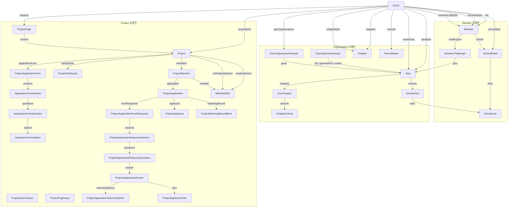

# GraphQL Schema

현재 프로젝트에서 구현되어 있는 GraphQL Schema 간의 관계를 나타낸다.

```mermaid
flowchart TD
  Query["Query"]

  subgraph Member 도메인
    Member["Member"]
    MemberChallenger["MemberChallenger"]
    SchoolDetail["SchoolDetail"]
    SchoolLink["SchoolLink"]
  end

  subgraph Organization 도메인
    Gisu["Gisu"]
    GisuOrganizationInput["GisuOrganizationInput"]
    GisuOrganizationPayload["GisuOrganizationPayload"]
    GisuChapter["GisuChapter"]
    GisuSchool["GisuSchool"]
    Chapter["Chapter"]
    ChapterSchool["ChapterSchool"]
    SchoolName["SchoolName"]
  end

  subgraph Project 도메인
    Project["Project"]
    ProjectPage["ProjectPage"]
    ProjectSearchInput["ProjectSearchInput"]
    ProjectPageInput["ProjectPageInput"]
    ProjectMember["ProjectMember"]
    ProjectPartQuota["ProjectPartQuota"]
    ProjectApplicationForm["ProjectApplicationForm"]
    ApplicationFormSection["ApplicationFormSection"]
    ApplicationFormQuestion["ApplicationFormQuestion"]
    ApplicationFormOption["ApplicationFormOption"]
    ProjectApplication["ProjectApplication"]
    ProjectApplicationFormResponse["ProjectApplicationFormResponse"]
    ProjectApplicationResponseSection["ProjectApplicationResponseSection"]
    ProjectApplicationResponseQuestion["ProjectApplicationResponseQuestion"]
    ProjectApplicationAnswer["ProjectApplicationAnswer"]
    ProjectApplicationSelectedOption["ProjectApplicationSelectedOption"]
    ProjectApplicationFile["ProjectApplicationFile"]
    ProjectApplicant["ProjectApplicant"]
    ProjectMatchingRoundBrief["ProjectMatchingRoundBrief"]
    MemberBrief["MemberBrief"]
  end

  Query -->|me| Member
  Query -->|memberById| Member
  Query -->|memberListByIds| Member
  Query -->|gisuOrganizations| GisuOrganizationPayload
  Query -->|gisuById| Gisu
  Query -->|activeGisu| Gisu
  Query -->|chapters| Chapter
  Query -->|chapterById| Chapter
  Query -->|schools| SchoolName
  Query -->|schoolById| SchoolDetail
  Query -->|projectById| Project
  Query -->|projects| ProjectPage

  GisuOrganizationInput -->|"ids | generations | active"| Gisu
  GisuOrganizationPayload -->|gisus| Gisu

  Member -->|school| SchoolDetail
  Member -->|challengers| MemberChallenger
  MemberChallenger -->|gisu| Gisu

  SchoolDetail -->|links| SchoolLink
  Gisu -->|chapters| GisuChapter
  Gisu -->|schools| GisuSchool
  GisuChapter -->|schools| ChapterSchool
  GisuSchool -->|links| SchoolLink

  ProjectPage -->|content| Project
  Project -->|productOwner| MemberBrief
  Project -->|coProductOwners| MemberBrief
  Project -->|partQuotas| ProjectPartQuota
  Project -->|members| ProjectMember
  Project -->|applicationForm| ProjectApplicationForm

  ProjectMember -->|member| MemberBrief
  ProjectMember -->|application| ProjectApplication
  ProjectApplication -->|applicant| ProjectApplicant
  ProjectApplication -->|matchingRound| ProjectMatchingRoundBrief
  ProjectApplication -->|formResponse| ProjectApplicationFormResponse

  ProjectApplicationForm -->|sections| ApplicationFormSection
  ApplicationFormSection -->|questions| ApplicationFormQuestion
  ApplicationFormQuestion -->|options| ApplicationFormOption

  ProjectApplicationFormResponse -->|sections| ProjectApplicationResponseSection
  ProjectApplicationResponseSection -->|questions| ProjectApplicationResponseQuestion
  ProjectApplicationResponseQuestion -->|answer| ProjectApplicationAnswer
  ProjectApplicationAnswer -->|selectedOptions| ProjectApplicationSelectedOption
  ProjectApplicationAnswer -->|files| ProjectApplicationFile
```
