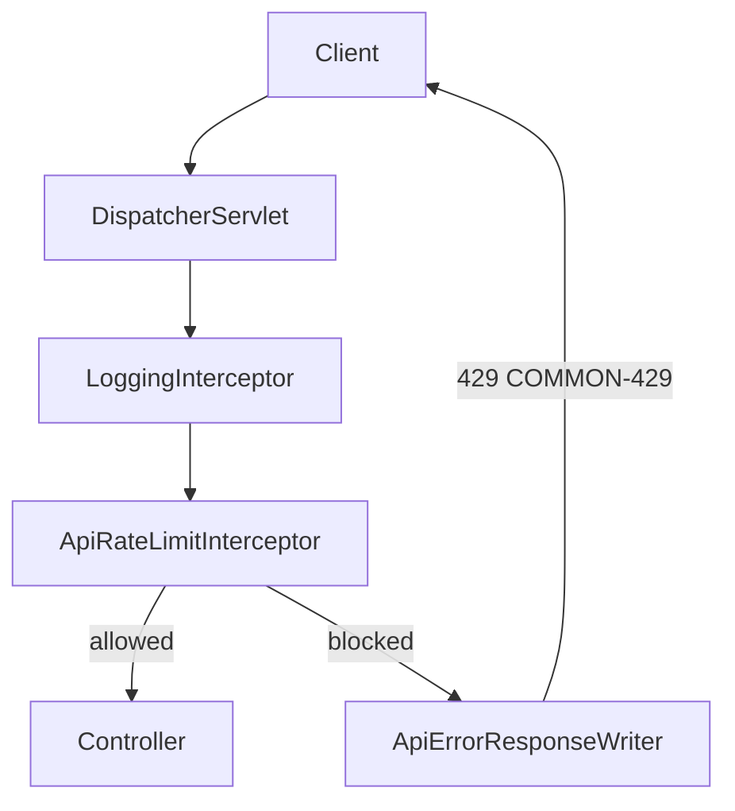
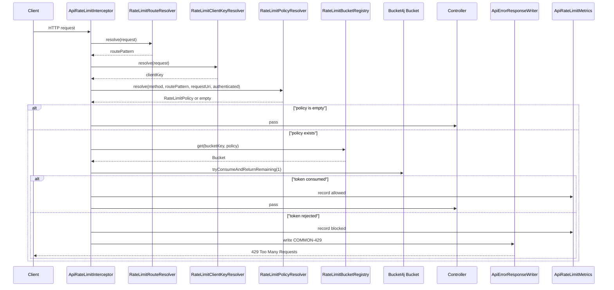
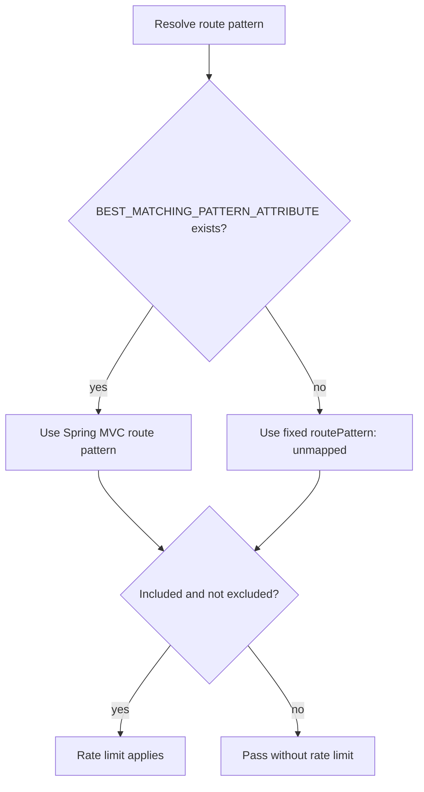
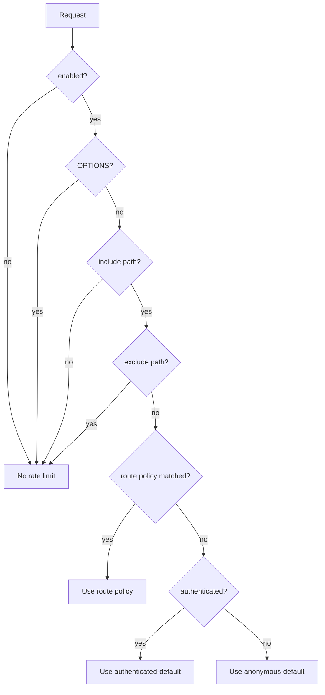

# API Rate Limiter

## 역할

API Rate Limiter는 FE 버그, 재시도 루프, 동일 사용자의 짧은 시간 반복 호출을 애플리케이션 진입 지점에서 빠르게 제한한다.

이 기능은 DDoS 전체 방어를 담당하지 않는다. DispatcherServlet까지 도달한 Spring MVC 요청 중 설정에 포함된 경로를 대상으로, 같은 client와 같은 endpoint pattern의 요청이 설정된 한도를 넘으면 `429 Too Many Requests`를 반환한다.

## 적용 위치

Rate Limiter는 `HandlerInterceptor`로 동작한다.

- 등록 위치: `src/main/java/com/umc/product/global/config/WebMvcConfig.java`
- 구현 위치: `src/main/java/com/umc/product/global/ratelimit`
- 설정 prefix: `app.api-rate-limit`
- 기본 활성화: `API_RATE_LIMIT_ENABLED`가 없으면 활성화된다.
- 비활성화: `API_RATE_LIMIT_ENABLED=false`

`WebMvcConfig`에서는 `LoggingInterceptor` 다음에 `ApiRateLimitInterceptor`를 등록한다. 이 순서 덕분에 rate limit으로 차단된 `429` 응답도 기존 요청 완료 로그에 남는다.



## 요청 처리 흐름

`ApiRateLimitInterceptor`는 요청마다 다음 순서로 동작한다.

1. `RateLimitRouteResolver`가 Spring MVC route pattern을 구한다.
2. `RateLimitClientKeyResolver`가 인증 사용자 또는 익명 IP 기준 client key를 만든다.
3. `RateLimitPolicyResolver`가 설정을 기준으로 적용할 정책을 고른다.
4. `RateLimitBucketRegistry`가 bucket key에 해당하는 Bucket4j bucket을 Caffeine에서 가져오거나 새로 만든다.
5. Bucket에서 token 1개를 소비한다.
6. token 소비에 성공하면 요청을 controller로 보낸다.
7. token 소비에 실패하면 `429` 응답을 작성하고 controller는 실행하지 않는다.



## Bucket key

Bucket key는 다음 형식이다.

```text
{clientKey}:{HTTP method}:{routePattern}
```

예시는 다음과 같다.

```text
member:42:GET:/api/v1/projects/{projectId}
ip:203.0.113.7:POST:/api/v1/projects/{projectId}/applications
```

`memberId` 또는 IP만으로 제한하지 않고 method와 route pattern까지 포함한다. 같은 사용자가 서로 다른 API를 호출하는 경우 bucket이 분리되고, 같은 API의 path variable 값만 달라지는 경우에는 같은 bucket을 공유한다.

## Route pattern 결정

`RateLimitRouteResolver`는 Spring MVC가 제공하는 `HandlerMapping.BEST_MATCHING_PATTERN_ATTRIBUTE`를 우선 사용한다.

```text
/api/v1/projects/1       -> /api/v1/projects/{projectId}
/api/v1/projects/999     -> /api/v1/projects/{projectId}
```

매핑되는 route pattern이 없으면 raw URI를 사용하지 않고 `unmapped` 고정값을 사용한다. 이렇게 해야 임의 경로 스캔이 매 요청마다 새로운 bucket을 만들거나 metric tag cardinality를 늘리는 문제를 막을 수 있다.

다만 적용 범위 판단은 request URI를 같이 본다. 예를 들어 `/api/**`에 포함되는 미매핑 요청은 `unmapped` bucket으로 제한하고, `/docs/**`처럼 제외 경로에 속한 미매핑 요청은 제한하지 않는다.



## Client key 결정

`RateLimitClientKeyResolver`는 인증 정보가 있으면 `MemberPrincipal.memberId`를 사용한다.

```text
member:{memberId}
```

인증 정보가 없으면 `request.getRemoteAddr()` 값을 사용한다.

```text
ip:{remoteAddr}
```

애플리케이션 코드는 `X-Forwarded-For`를 직접 파싱하지 않는다. 프록시 헤더 처리는 `server.forward-headers-strategy=framework` 같은 WAS/Spring Boot 설정을 통해 처리하고, rate limiter는 컨테이너가 정리한 `remoteAddr`만 신뢰한다.

## 정책 선택

기본 설정은 다음과 같다.

| 대상 | 초당 제한 | 분당 제한 |
|---|---:|---:|
| 인증 사용자 | 20 req/s | 300 req/min |
| 익명 IP | 5 req/s | 60 req/min |

현재 기본 설정에는 endpoint별 route override가 없다. 실제 서비스에 비싼 API가 생기면 `app.api-rate-limit.route-policies`에 명시적으로 추가한다.

정책 선택 조건은 다음 순서다.

1. `enabled=false`면 제한하지 않는다.
2. `OPTIONS` 요청은 제한하지 않는다.
3. include path에 없으면 제한하지 않는다.
4. exclude path에 있으면 제한하지 않는다.
5. 명시된 `route-policies`와 method/path가 맞으면 해당 정책을 사용한다.
6. 위 조건에 걸리지 않으면 인증 여부에 따라 default 정책을 사용한다.



## Bucket 저장 방식

`RateLimitBucketRegistry`는 Caffeine cache에 Bucket4j `Bucket`을 저장한다.

- 기본 maximum size: `100000`
- 기본 expire after access: `PT10M`
- bucket당 limit: 초 단위 limit과 분 단위 limit을 함께 가진다.
- refill 방식: `refillGreedy`

초 단위 limit은 순간 폭주를 막고, 분 단위 limit은 짧은 burst가 반복되는 상황을 완화한다.

## 제한 초과 응답

token 소비에 실패하면 controller는 실행되지 않고 `ApiErrorResponseWriter`가 기존 공통 에러 응답 형식으로 `COMMON-429`를 작성한다.

응답 헤더는 다음 값을 포함한다.

| Header | 의미 |
|---|---|
| `Retry-After` | 다시 시도하기까지 기다릴 초 단위 시간 |
| `X-RateLimit-Limit` | 적용된 초당 제한값 |
| `X-RateLimit-Remaining` | 남은 token 수. 차단 시 `0` |

응답 예시는 다음과 같다.

```http
HTTP/1.1 429 Too Many Requests
Retry-After: 1
X-RateLimit-Limit: 20
X-RateLimit-Remaining: 0
```

```json
{
  "success": false,
  "code": "COMMON-429",
  "message": "요청이 너무 많습니다. 잠시 후 다시 시도해주세요."
}
```

## 관측

`ApiRateLimitMetrics`는 다음 counter를 기록한다.

```text
api.rate_limit.requests.total
```

tag는 다음과 같다.

| Tag | 예시 |
|---|---|
| `result` | `allowed`, `blocked` |
| `rule` | `authenticated-default`, `anonymous-default`, `custom` |
| `method` | `GET`, `POST` |
| `uriTemplate` | `/api/v1/projects/{projectId}`, `unmapped` |
| `clientType` | `WEB`, `ANONYMOUS`, `UNKNOWN` |

metric tag에는 raw `memberId`나 raw IP를 넣지 않는다. 차단 로그도 `method`, `routePattern`, `clientType`, `retryAfterSeconds`, `keyHash`만 남긴다.

## 운영 시 주의사항

- 이 rate limiter는 애플리케이션 인스턴스 내부 메모리 기반이다. 여러 pod가 있으면 pod마다 bucket이 따로 생긴다.
- 전체 서비스 공통 한도를 강하게 보장해야 하면 Redis 기반 distributed limiter나 Gateway/CDN rate limit을 별도 레이어로 둔다.
- Spring Security 앞단에서 차단되는 토큰 없는 보호 API flood는 이 interceptor까지 도달하지 않을 수 있다.
- GraphQL처럼 단일 endpoint로 여러 operation이 들어오는 구조는 `method + routePattern`만으로 충분하지 않다. GraphQL 도입 시 operation name 또는 persisted query id 기준의 별도 정책이 필요하다.
- 없는 API에 대한 route policy는 기본값에 넣지 않는다. 실제 비싼 endpoint가 생길 때 `app.api-rate-limit.route-policies`에 명시한다.
