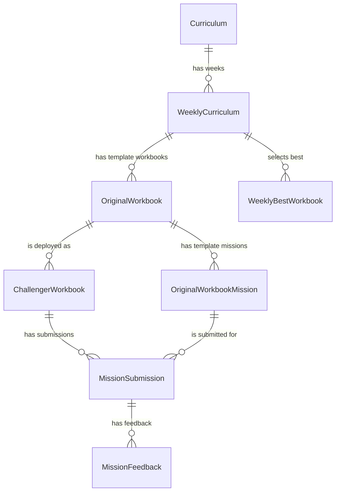

# Curriculum Domain

## 역할

`curriculum` 도메인은 기수와 파트별 커리큘럼, 주차별 커리큘럼, 원본 워크북, 챌린저 워크북, 미션 제출과 피드백을 관리한다.

## 책임

- 커리큘럼과 주차별 커리큘럼을 생성, 수정, 삭제한다.
- 원본 워크북을 작성, 임시저장, 배포, 상태 변경한다.
- 챌린저 워크북 제출, 인정, 삭제를 처리한다.
- 미션 제출물과 피드백을 관리한다.

## 경계

챌린저, 기수, 스터디 그룹, 파일은 다른 도메인의 소유다. 커리큘럼 도메인은 ID로 연결하고 필요한 검증은 공개 UseCase를 통해 수행한다.

## 핵심 모델 관계

`curriculum` 도메인은 원본 콘텐츠와 챌린저별 제출 상태를 분리해서 관리한다. 교육국이 관리하는 템플릿은 `OriginalWorkbook`과 `OriginalWorkbookMission`이고, 챌린저에게 배포된 개별 작업 단위는 `ChallengerWorkbook`과 `MissionSubmission`이다.

### 엔티티별 의미

- `Curriculum`: 특정 기수와 파트에 대한 상위 커리큘럼이다. 다른 도메인의 기수는 `gisuId`로만 참조한다.
- `WeeklyCurriculum`: 커리큘럼 안의 주차 단위다. 정규 주차와 부록 주차를 `weekNo`, `isExtra` 조합으로 구분한다.
- `OriginalWorkbook`: 주차별 커리큘럼에 속한 원본 워크북이다. 교육국이 작성하고 `DRAFT`, `READY`, `RELEASED` 상태로 관리한다.
- `OriginalWorkbookMission`: 원본 워크북에 포함된 원본 미션이다. 제출 방식과 필수 여부를 정의한다.
- `ChallengerWorkbook`: 원본 워크북이 특정 챌린저에게 배포된 개별 워크북이다. `memberId`, `studyGroupId`는 다른 도메인 Aggregate를 직접 참조하지 않고 ID로 저장한다.
- `MissionSubmission`: 챌린저가 특정 원본 미션에 대해 제출한 결과다. 하나의 제출은 `ChallengerWorkbook`과 `OriginalWorkbookMission`을 함께 참조한다.
- `MissionFeedback`: 제출물에 대한 운영진 피드백이다. 리뷰어는 `reviewerMemberId`로만 참조한다.
- `WeeklyBestWorkbook`: 주차별 베스트 워크북 선정 결과다. 현재는 `ChallengerWorkbook` FK가 아니라 `WeeklyCurriculum`, `memberId`, `studyGroupId` 조합으로 표현한다.

### 흐름

1. 운영진이 `Curriculum`을 만들고 그 아래에 `WeeklyCurriculum`을 생성한다.
2. 교육국이 주차별로 `OriginalWorkbook`을 작성하고, 필요한 `OriginalWorkbookMission`을 붙인다.
3. 원본 워크북이 배포 가능한 상태가 되면 챌린저별 `ChallengerWorkbook`이 생성된다.
4. 챌린저는 원본 미션마다 `MissionSubmission`을 생성한다.
5. 운영진은 제출물에 `MissionFeedback`을 남기고, 주차별 조건을 만족한 챌린저를 `WeeklyBestWorkbook`으로 선정한다.

### 구현상 주의점

- 도메인 내부 JPA 관계는 자식이 부모를 `@ManyToOne(fetch = FetchType.LAZY)`로 참조하는 방향을 기본으로 한다.
- 컬렉션 `@OneToMany`는 두지 않는다. 목록 조회는 포트와 리포지토리에서 ID 기반 조회나 IN query로 처리한다.
- 챌린저, 멤버, 기수, 스터디 그룹, 파일 정보가 필요하면 해당 도메인의 공개 Query UseCase를 호출한다.
- 원본 워크북과 원본 미션은 템플릿이고, 챌린저 워크북과 미션 제출은 사용자별 진행 상태다. 두 개념을 섞으면 배포 이후 수정 제한, 제출 여부, 피드백 조회 정책이 꼬일 수 있다.

## UX Writing Notes

운영자 작업이 많으므로 삭제 불가, 배포 후 수정 제한, 권한 제한을 명확히 쓴다. `삭제할 수 없어요` 뒤에는 `제출 내역을 먼저 확인해주세요`, `원본 워크북을 먼저 정리해주세요`처럼 다음 행동을 붙인다.
