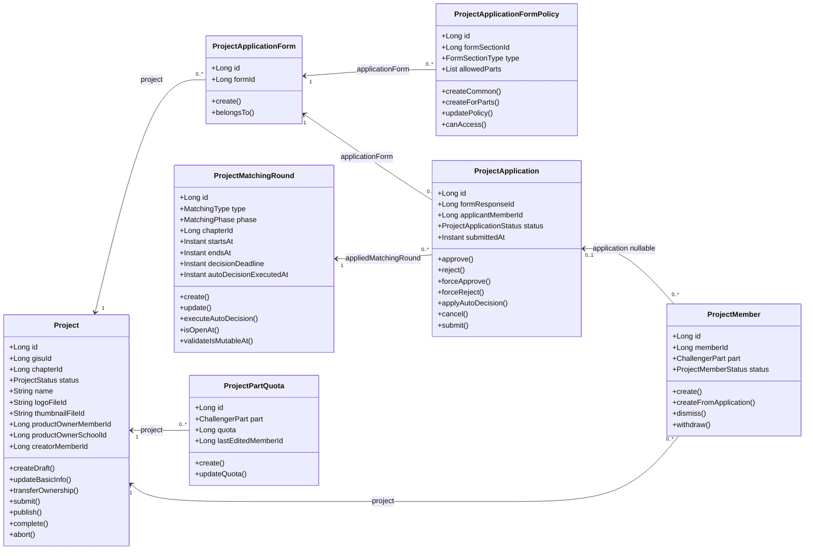
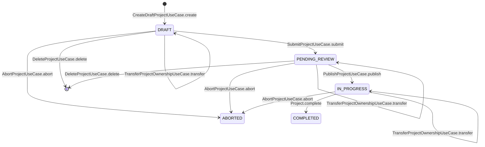
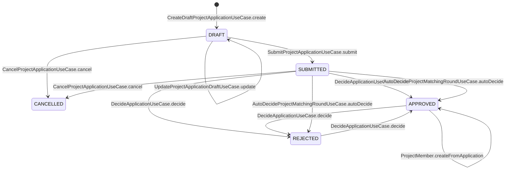

# Project Domain

## 빠른 구조 다이어그램

### Entity 관계

`project` 도메인의 외부 도메인 참조는 Aggregate 직접 참조가 아니라 ID 참조로 유지한다. 예를 들어 `Project.gisuId`, `Project.chapterId`, `Project.productOwnerMemberId`, `Project.productOwnerSchoolId`, `ProjectApplicationForm.formId`, `ProjectApplication.formResponseId`, `ProjectMember.memberId`가 그 경계다.



### 상태 전이와 핵심 Action





### Command UseCase 지도

```mermaid
flowchart TB
  subgraph InAdapter["adapter/in"]
    ProjectCommandController["ProjectCommandController"]
    ProjectApplicationController["ProjectApplicationController"]
    ProjectApplicationFormController["ProjectApplicationFormController"]
    ProjectMatchingRoundController["ProjectMatchingRoundController"]
    MatchingRoundDeadlineHandler["MatchingRoundDeadlineHandler"]
  end

  subgraph CommandService["application/service/command"]
    ProjectCommandService["ProjectCommandService"]
    ProjectApplicationCommandService["ProjectApplicationCommandService"]
    ProjectApplicationFormCommandService["ProjectApplicationFormCommandService"]
    ProjectPartQuotaCommandService["ProjectPartQuotaCommandService"]
    ProjectMemberCommandService["ProjectMemberCommandService"]
    ProjectMatchingRoundCommandService["ProjectMatchingRoundCommandService"]
    ProjectMatchingRoundFinalizationCommandService["ProjectMatchingRoundFinalizationCommandService"]
  end

  subgraph UseCaseAction["port/in/command -> domain action"]
    ProjectLifecycle["Create/Update/Submit/Transfer/Publish/Complete/Delete/Abort Project<br/>Project.createDraft, updateBasicInfo, submit, publish, complete, abort"]
    ApplicationLifecycle["Create/Update/Submit/Cancel/Decide Application<br/>ProjectApplication.create, submit, cancel, approve, reject"]
    ApplicationFormUpsert["UpsertProjectApplicationFormUseCase.upsert<br/>Survey Form diff + ProjectApplicationFormPolicy sync"]
    QuotaMember["UpdatePartQuotas, AddProjectMember, RemoveProjectMember<br/>ProjectPartQuota.create/updateQuota, ProjectMember.create/dismiss"]
    MatchingRoundLifecycle["Create/Update/Delete MatchingRound<br/>ProjectMatchingRound.create/update + deadline schedule"]
    MatchingRoundFinalize["AutoDecideProjectMatchingRoundUseCase.autoDecide<br/>ProjectApplication.applyAutoDecision + ProjectMember.createFromApplication"]
  end

  ProjectCommandController --> ProjectCommandService
  ProjectCommandController --> ProjectPartQuotaCommandService
  ProjectCommandController --> ProjectMemberCommandService
  ProjectApplicationController --> ProjectApplicationCommandService
  ProjectApplicationFormController --> ProjectApplicationFormCommandService
  ProjectMatchingRoundController --> ProjectMatchingRoundCommandService
  ProjectMatchingRoundController --> ProjectMatchingRoundFinalizationCommandService
  MatchingRoundDeadlineHandler --> ProjectMatchingRoundFinalizationCommandService

  ProjectCommandService --> ProjectLifecycle
  ProjectApplicationCommandService --> ApplicationLifecycle
  ProjectApplicationFormCommandService --> ApplicationFormUpsert
  ProjectPartQuotaCommandService --> QuotaMember
  ProjectMemberCommandService --> QuotaMember
  ProjectMatchingRoundCommandService --> MatchingRoundLifecycle
  ProjectMatchingRoundFinalizationCommandService --> MatchingRoundFinalize

  ProjectLifecycle --> ProjectPorts["Load/SaveProject*, Load/SaveApplicationForm*, Load/SavePartQuota*, Load/SaveMember* Port"]
  ApplicationLifecycle --> ApplicationPorts["Load/SaveProjectApplication*, LoadMatchingRound, LoadPartQuota, LoadProjectMember Port"]
  ApplicationFormUpsert --> SurveyCommand["survey ManageForm/Section/Question/Option UseCase"]
  MatchingRoundFinalize --> MatchingPolicy["MatchingDecisionPolicy<br/>DesignerMatchingPolicy / DeveloperMatchingPolicy"]
```



### Query UseCase 지도

```mermaid
flowchart TB
  subgraph QueryController["adapter/in query"]
    ProjectQueryController["ProjectQueryController"]
    ProjectApplicationQueryController["ProjectApplicationQueryController"]
    ProjectApplicationFormControllerQ["ProjectApplicationFormController"]
    ProjectPermissionController["ProjectPermissionController"]
    ProjectStatisticsQueryController["ProjectStatisticsQueryController"]
    ProjectMatchingRoundControllerQ["ProjectMatchingRoundController"]
  end

  subgraph QueryService["application/service/query"]
    ProjectQueryService["ProjectQueryService<br/>GetProject, SearchProject, SearchManagedProject"]
    ProjectApplicationQueryService["ProjectApplicationQueryService<br/>GetMyApplications, GetApplicationDetail, SearchApplications"]
    ProjectApplicationFormQueryService["ProjectApplicationFormQueryService<br/>GetProjectApplicationForm"]
    ProjectMatchingRoundQueryService["ProjectMatchingRoundQueryService<br/>GetProjectMatchingRound"]
    ProjectMemberQueryService["ProjectMemberQueryService<br/>GetRandomMatchedProjectMember"]
    ProjectPermissionQueryService["ProjectPermissionQueryService<br/>GetProjectPermissions"]
    ProjectStatisticsQueryService["ProjectStatisticsQueryService<br/>GetProjectStatistics"]
  end

  ProjectQueryController --> ProjectQueryService
  ProjectQueryController --> ProjectMemberQueryService
  ProjectApplicationQueryController --> ProjectApplicationQueryService
  ProjectApplicationFormControllerQ --> ProjectApplicationFormQueryService
  ProjectPermissionController --> ProjectPermissionQueryService
  ProjectStatisticsQueryController --> ProjectStatisticsQueryService
  ProjectMatchingRoundControllerQ --> ProjectMatchingRoundQueryService

  ProjectQueryService --> ProjectReadPorts["LoadProject, LoadProjectMember, LoadProjectPartQuota Port"]
  ProjectApplicationQueryService --> ApplicationReadPorts["LoadProjectApplication, LoadApplicationForm, LoadPolicy Port"]
  ProjectApplicationFormQueryService --> FormReadPorts["LoadApplicationForm, LoadPolicy Port"]
  ProjectMatchingRoundQueryService --> RoundReadPorts["LoadProjectMatchingRound Port"]
  ProjectMemberQueryService --> MemberReadPorts["LoadProjectMember Port"]
  ProjectPermissionQueryService --> PermissionEval["ProjectPermissionEvaluator"]
  ProjectStatisticsQueryService --> StatisticsPort["LoadProjectStatistics Port"]

  ProjectReadPorts --> CrossDomainQuery["storage/member/challenger/survey/organization 공개 Query UseCase로 응답 조립"]
  ApplicationReadPorts --> CrossDomainQuery
  FormReadPorts --> CrossDomainQuery
  StatisticsPort --> CrossDomainQuery
```



## 역할

`project` 도메인은 프로젝트 생성, 제출, 공개, 팀원 관리, 지원서, 지원 폼, 매칭 차수와 자동 선발 정책을 관리한다.

## 책임

- 프로젝트 초안 작성부터 공개까지 상태 전이를 관리한다.
- 프로젝트 PO, Sub-PO, 팀원을 관리한다.
- 지원 폼과 지원서를 생성, 임시저장, 제출, 평가한다.
- 매칭 차수와 파트별 정원, 자동 선발을 관리한다.

## 지원서 합/불 결정과 최소 선발 규정

PM은 `PATCH /api/v1/projects/{projectId}/applications/{applicationId}/decision`으로 지원서를 `APPROVED` 또는 `REJECTED`로 변경한다. 요청 DTO는 `ApplicationDecisionStatus.APPROVED`, `ApplicationDecisionStatus.REJECTED`만 허용하며, 현재 단건 결정 API에는 `SUBMITTED`로 되돌리는 입력값이 없다.

`APPROVED` 변경은 잔여 정원만 검증한다. 잔여 정원은 `파트별 TO - 기존 ACTIVE 멤버 수 - 현재 차수의 같은 프로젝트/파트 APPROVED 수`로 계산하며, 초과하면 `PROJECT_APPLICATION_QUOTA_EXCEEDED` 409를 반환한다.

`REJECTED` 변경은 변경 후에도 매칭 정책의 최소 선발 인원을 만족하는지 먼저 검증한다. 검증은 현재 지원서를 제외한 같은 차수, 같은 프로젝트, 같은 파트의 `APPROVED` 수를 기준으로 한다.

- `PLAN_DESIGN`: 지원자가 2명 이상이면 최소 1명 `APPROVED`가 필요하다. 지원자가 1명이면 최소 선발 의무가 없다.
- `PLAN_DEVELOPER`: 지원자가 TO 이상이면 최소 `ceil(TO * 0.5)`명, 지원자가 TO의 50% 초과 100% 미만이면 최소 `ceil(TO * 0.25)`명, 지원자가 TO의 50% 이하면 최소 선발 의무가 없다.

최소 선발 규정을 만족하지 못하면 `PROJECT_APPLICATION_MINIMUM_SELECTION_REQUIRED` 409를 반환한다. 이 예외는 `application.reject()` 호출 전에 발생하므로 BE 트랜잭션 안에서는 지원서 status를 변경하지 않고 저장도 수행하지 않는다. 예를 들어 `APPROVED`였던 지원자를 `REJECTED`로 바꾸면 최소 인원이 깨지는 상황에서는 DB 상태가 기존 `APPROVED`로 유지되어야 한다.

응답 예시는 다음과 같다.

```json
{
  "success": false,
  "code": "PROJECT-0216",
  "message": "매칭 규칙의 최소 선발 인원을 충족하지 않아 불합격 처리할 수 없어요. 합격 인원을 확인해주세요.",
  "result": "매칭 규칙의 최소 선발 인원을 충족하지 않아 불합격 처리할 수 없어요. 합격 인원을 확인해주세요."
}
```

## 상태 흔들림 분석 메모

관측 증상: `APPROVED` 상태의 지원자를 `REJECTED`로 변경하려고 할 때 최소 선발 규정에 실패하면 기존 `APPROVED`가 유지되어야 하나, 화면에서는 시도할 때마다 `SUBMITTED`와 `APPROVED`가 번갈아 보일 수 있다.

현재 BE 단건 결정 로직 기준으로는 실패 응답 이후 `SUBMITTED`로 전이되는 경로가 없다. `ApplicationDecisionStatus`는 `APPROVED`, `REJECTED`만 받고, 최소 선발 검증 실패는 `ProjectApplicationCommandService.validateMinimumSelectionAfterRejection()`에서 `ProjectApplication.reject()`보다 먼저 발생한다. 따라서 `PROJECT-0216`이 반환된 요청 하나만 놓고 보면 저장된 status는 기존 값, 보통 `APPROVED`, 그대로 남아야 한다.

가능성이 높은 확인 지점은 다음과 같다.

- FE가 409 실패 응답을 받은 뒤 요청 전 상태를 복원하지 않고 낙관적 업데이트나 기본 대기 상태를 적용하는지 확인한다.
- FE가 실패 응답의 `success=false`와 HTTP 409를 성공 응답처럼 처리하면서 `result.status`가 없을 때 `SUBMITTED`를 fallback으로 넣는지 확인한다.
- 실패 직후 재조회 API가 `status=SUBMITTED` 같은 필터를 붙여 호출되는지, 또는 이전 목록 응답 캐시가 섞이는지 확인한다.
- 같은 매칭 차수의 `decisionDeadline` 경과 후 자동 선발이 실행되는 시점인지 확인한다. 자동 선발은 부족분을 `SUBMITTED` 풀에서 random 보충하고, 필요하면 `REJECTED` 풀도 override할 수 있어 화면에서 랜덤성이 보일 수 있다. 다만 자동 선발은 실행 완료 후 `autoDecisionExecutedAt`으로 멱등 처리되므로 같은 차수에서 계속 반복 실행되지는 않아야 한다.

BE 확인 기준은 명확하다. `PATCH .../decision`이 `PROJECT-0216` 409를 반환한 직후 동일 `applicationId`를 DB 또는 `GET /api/v1/projects/{projectId}/applications/{applicationId}`로 재조회했을 때 status가 `APPROVED`라면 단건 결정 로직은 의도대로 동작한 것이다. 재조회 결과가 `SUBMITTED`라면 별도 BE 저장 경로, 테스트 seed, 자동 선발, 또는 조회 조건을 추가로 추적해야 한다.

## 상세 문서

- [PLAN_DEVELOPER 3차 종료 후 잔여 TO 자동 배정](../project/plan-developer-third-auto-assignment.md)

## 경계

프로젝트 참여자의 회원·챌린저·조직 정보는 다른 도메인에서 온다. project는 ID를 보관하고, 조회 응답 조립 시 필요한 정보만 공개 UseCase로 가져온다.

## UX Writing Notes

프로젝트는 상태 전이가 많으므로 `현재 상태에서는 할 수 없는 작업이에요. 프로젝트 상태를 확인해주세요`처럼 상태 확인을 안내한다. 내부 상태값은 운영자가 식별해야 하는 경우에만 노출한다.
