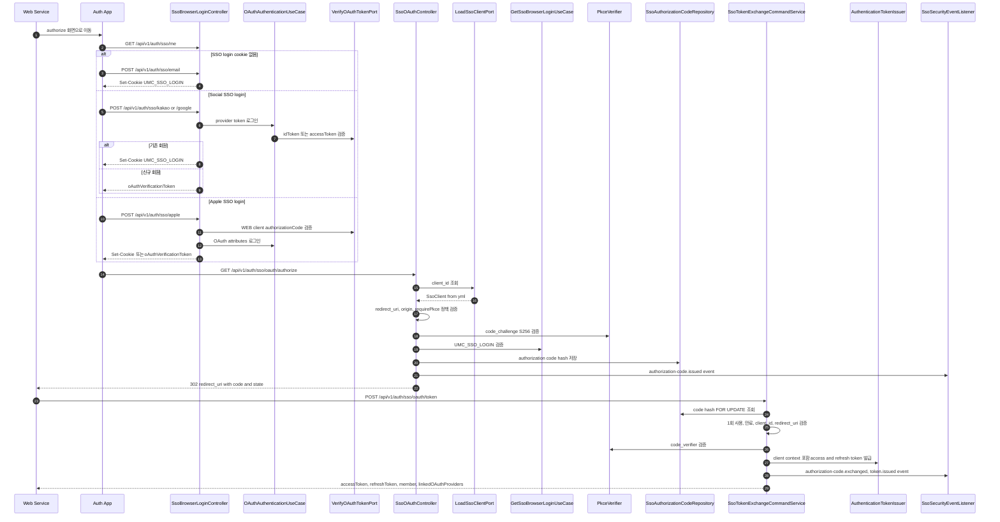
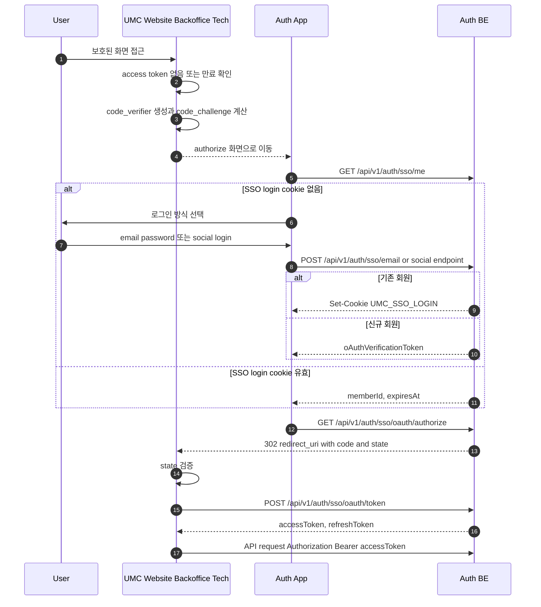
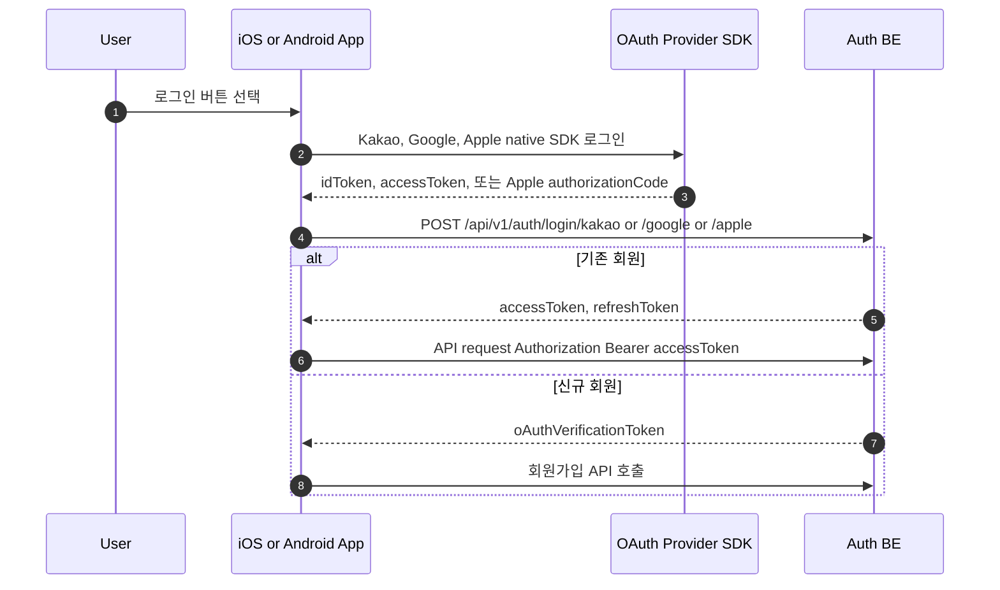

# SSO Authentication Flow

이 문서는 UMC 웹 서비스가 Auth App/Auth BE를 통해 SSO 로그인을 수행할 때의 서버 내부 흐름과 클라이언트 연동 흐름을 정리한다.

리소스 API 인증은 계속 `Authorization: Bearer <access_token>` 기반 stateless JWT 인증이다. `UMC_SSO_LOGIN` cookie는 Auth App 브라우저 로그인 상태를 표현하는 전용 JWT이며, 일반 API 인증 수단으로 사용하지 않는다.

현재 앱은 기존 native SDK direct login을 유지한다. 앱은 Kakao, Google, Apple SDK로 받은 provider token 또는 Apple authorization code를 기존 `/api/v1/auth/login/**` endpoint로 전달하고, SSO authorization code flow로 이전하지 않는다.

## 서버 내부 흐름

### 서버 내부 흐름 설명

`app.sso.clients` 설정이 SSO client registry의 단일 기준이다. 서버는 `client_id`로 설정을 조회하고, 등록된 `redirect_uri`만 허용한다. 운영 `UMC_WEBSITE` origin은 `https://university.neordinary.com`이며 `www`를 붙이지 않는다. dev profile에서는 localhost를 `http://localhost:5173`만 허용한다.

`GET /api/v1/auth/sso/oauth/authorize`는 Authorization Code + PKCE 전용이다. 모든 현재 client는 `require-pkce: true`이고, `requirePkce=false` 설정은 지원하지 않는 SSO client 정책으로 거부한다. authorize 요청에서 `Origin` 또는 `Referer`가 존재하면 각각의 origin이 client의 `allowed-origins` 안에 있어야 한다. 단, OAuth authorize는 브라우저 top-level navigation으로 호출될 수 있어 두 헤더가 모두 없을 수 있으며, 이 경우에는 `client_id`, `redirect_uri`, SSO login cookie, PKCE 검증으로 흐름을 보호한다.

Authorization code는 raw 값을 저장하지 않고 SHA-256 hash만 저장한다. `POST /api/v1/auth/sso/oauth/token`은 hash를 `FOR UPDATE`로 조회해 code의 1회 사용을 보장하고, `client_id`, `redirect_uri`, 만료 시각, `code_verifier`를 모두 검증한 뒤 access/refresh token을 발급한다.

## 웹 클라이언트 로그인 흐름

### 웹 클라이언트 연동 설명

웹 서비스는 자체 로그인 폼을 갖지 않고 Auth App으로 이동시킨다. 서비스는 authorize 진입 전에 `code_verifier`를 생성해 세션 저장소, memory, 또는 안전한 client-side 저장소에 잠시 보관하고, `code_challenge=S256(code_verifier)`를 authorize 요청에 포함한다.

Auth App은 먼저 `GET /api/v1/auth/sso/me`로 브라우저 로그인 상태를 확인한다. cookie가 없거나 만료되면 email/password 또는 social SSO endpoint로 로그인한다. Kakao/Google SSO request는 `idToken`을 우선 사용하고, 없으면 `accessToken`을 허용한다. Apple SSO request는 `authorizationCode`를 전달하며 서버는 `ClientType.WEB` 기준으로 검증한다.

기존 회원이면 Auth BE가 `UMC_SSO_LOGIN` HttpOnly cookie를 설정하고 `memberId`, `expiresAt`을 반환한다. 신규 회원이면 cookie를 설정하지 않고 `oAuthVerificationToken`을 반환하므로 authorization code 발급으로 이어지지 않고 회원가입 흐름으로 이동해야 한다.

서비스 callback은 반드시 `state`를 검증한 뒤 `POST /api/v1/auth/sso/oauth/token`을 `application/x-www-form-urlencoded`로 호출한다. token 요청에는 `grant_type=authorization_code`, `code`, `client_id`, `redirect_uri`, `code_verifier`가 필요하다. 이후 리소스 API 호출에는 cookie가 아니라 `Authorization: Bearer <accessToken>`만 사용한다.

## 앱 클라이언트 로그인 흐름

### 앱 클라이언트 연동 설명

앱은 이번 SSO 변경에서 기존 native SDK direct login을 유지한다. 즉 앱은 `/api/v1/auth/sso/**` endpoint와 `UMC_SSO_LOGIN` cookie를 사용하지 않는다.

Kakao/Google 앱 request는 기존처럼 SDK에서 받은 `idToken` 또는 `accessToken`을 `POST /api/v1/auth/login/kakao`, `POST /api/v1/auth/login/google`로 전달한다. Apple 앱 request는 `authorizationCode`와 앱 client type을 `POST /api/v1/auth/login/apple`로 전달한다.

앱도 token 발급 이후에는 웹과 동일하게 access/refresh token 기반으로 동작한다. 일반 API 요청에는 `UMC_SSO_LOGIN` cookie를 붙이지 않고 `Authorization: Bearer <accessToken>`만 사용한다.

## SSO API 변경 사항

| Method | URI | 역할 | 주요 요청 | 주요 응답 |
| --- | --- | --- | --- | --- |
| POST | `/api/v1/auth/sso/email` | Auth App email/password SSO 로그인 | `email`, `password` | 기존 회원 `Set-Cookie: UMC_SSO_LOGIN`, `memberId`, `expiresAt` |
| POST | `/api/v1/auth/sso/kakao` | Kakao 기반 SSO 로그인 | `idToken` 우선, 없으면 `accessToken` | 기존 회원 cookie, 신규 회원 `oAuthVerificationToken` |
| POST | `/api/v1/auth/sso/google` | Google 기반 SSO 로그인 | `idToken` 우선, 없으면 `accessToken` | 기존 회원 cookie, 신규 회원 `oAuthVerificationToken` |
| POST | `/api/v1/auth/sso/apple` | Apple 기반 SSO 로그인 | `authorizationCode` | 기존 회원 cookie, 신규 회원 `oAuthVerificationToken` |
| GET | `/api/v1/auth/sso/me` | 현재 Auth App 브라우저 로그인 조회 | `UMC_SSO_LOGIN` cookie | `memberId`, `expiresAt` |
| POST | `/api/v1/auth/sso/logout` | Auth App 브라우저 로그아웃 | 없음 | `UMC_SSO_LOGIN` cookie 삭제 |
| GET | `/api/v1/auth/sso/oauth/authorize` | SSO authorization code 발급 | `client_id`, `redirect_uri`, `response_type=code`, `state`, PKCE, cookie | `302 redirect_uri?code=...&state=...` |
| POST | `/api/v1/auth/sso/oauth/token` | authorization code를 service token으로 교환 | `grant_type=authorization_code`, `code`, `client_id`, `redirect_uri`, `code_verifier` | `accessToken`, `refreshToken`, `member`, `linkedOAuthProviders` |

기존 앱/direct OAuth endpoint는 이번 변경에서 유지한다.

| Method | URI | 사용 주체 | 역할 |
| --- | --- | --- | --- |
| POST | `/api/v1/auth/login/kakao` | iOS, Android 앱 | native SDK Kakao direct login |
| POST | `/api/v1/auth/login/google` | iOS, Android 앱 | native SDK Google direct login |
| POST | `/api/v1/auth/login/apple` | iOS, Android 앱 | native SDK Apple direct login |

## 운영 체크리스트

- `JWT_SSO_LOGIN_TOKEN_SECRET`은 access/refresh/oauth/email token secret과 다른 값이어야 한다.
- `app.sso.clients.*.redirect-uris`와 `allowed-origins`는 배포 도메인 변경 시 함께 갱신한다.
- dev profile에서는 `http://localhost:5173`만 client context origin과 SSO allowed origin으로 연다.
- 운영 `UMC_WEBSITE` origin은 `https://university.neordinary.com`이며 `www`를 붙이지 않는다.
- SSO 보안 이벤트는 application event로 발행되고 listener에서 metric으로 기록된다.
- Authorization code는 raw 값을 로그나 DB에 남기지 않는다.
