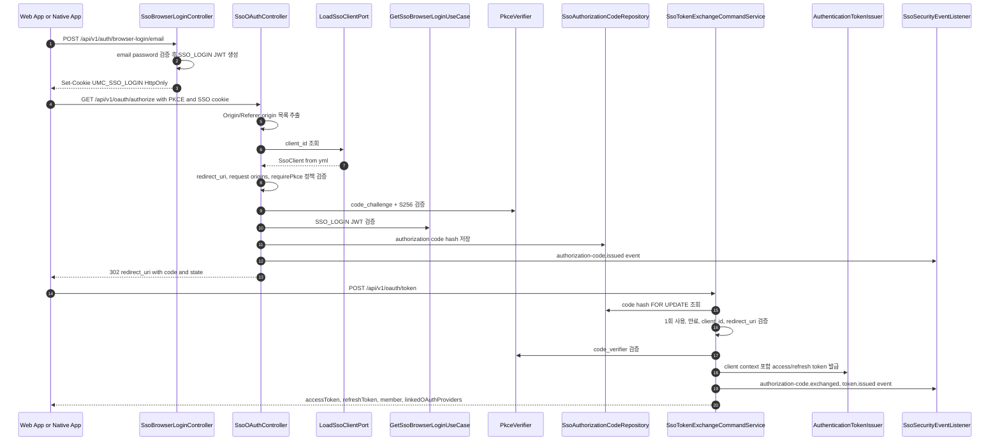
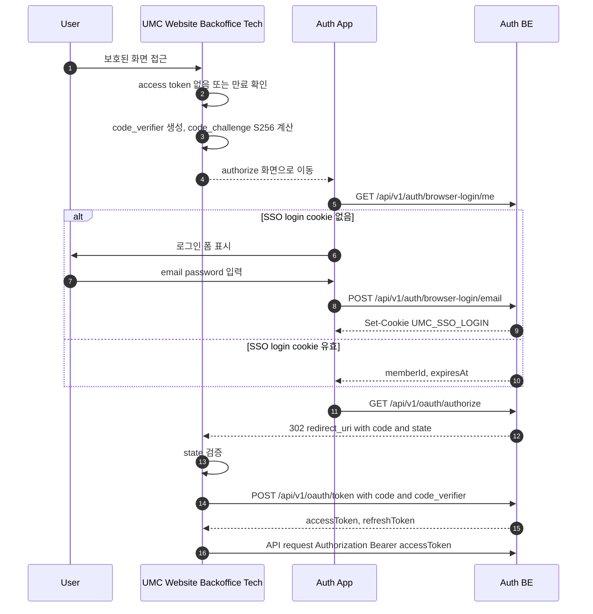
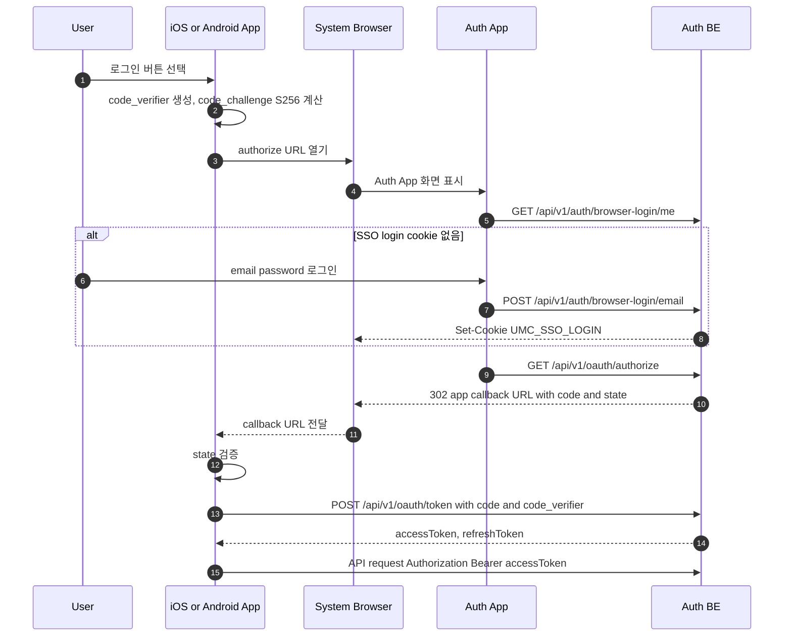

# SSO Authentication Flow

이 문서는 UMC 서비스가 Auth App/Auth BE를 통해 SSO 로그인을 수행할 때의 서버 내부 흐름과 클라이언트 연동 흐름을 정리한다.

리소스 API 인증은 계속 `Authorization: Bearer <access_token>` 기반 stateless JWT 인증이다. `UMC_SSO_LOGIN` cookie는 Auth App 브라우저 로그인 상태를 표현하는 전용 JWT이며, 일반 API 인증 수단으로 사용하지 않는다.

## 서버 내부 흐름

### 서버 내부 흐름 설명

`app.sso.clients` 설정이 SSO client registry의 단일 기준이다. 서버는 `client_id`로 설정을 조회하고, 등록된 `redirect_uri`만 허용한다. 운영 `UMC_WEBSITE` origin은 `https://university.neordinary.com`이며 `www`를 붙이지 않는다.

`/api/v1/oauth/authorize`는 Authorization Code + PKCE 전용이다. 모든 현재 client는 `require-pkce: true`이고, `requirePkce=false` 설정은 지원하지 않는 SSO client 정책으로 거부한다. authorize 요청에서 `Origin` 또는 `Referer`가 존재하면 각각의 origin이 client의 `allowed-origins` 안에 있어야 한다. 단, OAuth authorize는 브라우저 top-level navigation으로 호출될 수 있어 두 헤더가 모두 없을 수 있으며, 이 경우에는 `client_id`, `redirect_uri`, SSO login cookie, PKCE 검증으로 흐름을 보호한다.

Authorization code는 raw 값을 저장하지 않고 SHA-256 hash만 저장한다. `/api/v1/oauth/token`은 hash를 `FOR UPDATE`로 조회해 code의 1회 사용을 보장하고, `client_id`, `redirect_uri`, 만료 시각, `code_verifier`를 모두 검증한 뒤 access/refresh token을 발급한다.

## 웹 클라이언트 로그인 흐름

### 웹 클라이언트 연동 설명

웹 서비스는 자체 로그인 폼을 갖지 않고 Auth App으로 이동시킨다. 서비스는 authorize 진입 전에 `code_verifier`를 생성해 세션 저장소, memory, 또는 안전한 client-side 저장소에 잠시 보관하고, `code_challenge=S256(code_verifier)`를 authorize 요청에 포함한다.

Auth App은 먼저 `/api/v1/auth/browser-login/me`로 브라우저 로그인 상태를 확인한다. cookie가 없거나 만료되면 `/api/v1/auth/browser-login/email`로 로그인하고, Auth BE는 `UMC_SSO_LOGIN` HttpOnly cookie를 설정한다.

서비스 callback은 반드시 `state`를 검증한 뒤 `/api/v1/oauth/token`을 `application/x-www-form-urlencoded`로 호출한다. token 요청에는 `grant_type=authorization_code`, `code`, `client_id`, `redirect_uri`, `code_verifier`가 필요하다. 이후 리소스 API 호출에는 cookie가 아니라 `Authorization: Bearer <accessToken>`만 사용한다.

## 앱 클라이언트 로그인 흐름

### 앱 클라이언트 연동 설명

앱은 내장 WebView가 아니라 OS가 제공하는 외부 브라우저 기반 인증 세션을 사용한다. iOS는 `ASWebAuthenticationSession`, Android는 Chrome Custom Tabs 계열을 우선 사용한다. 이렇게 해야 Auth App의 SSO login cookie가 브라우저 컨텍스트에서 안전하게 관리되고, 앱은 authorization code만 callback으로 받는다.

앱 client의 `redirect_uri`는 `umc-ios://auth/callback`, `umc-android://auth/callback` 같은 custom scheme 또는 등록된 app link를 사용한다. 앱 client는 브라우저 Origin을 안정적으로 보낼 수 없으므로 `allowed-origins`를 비워 두고, 서버는 native app client에 대해서만 origin 검증을 우회한다. 이 경우에도 `client_id`, 등록된 `redirect_uri`, `state`, PKCE가 필수 보호 장치다.

앱도 token 교환 이후에는 웹과 동일하게 access/refresh token 기반으로 동작한다. 일반 API 요청에는 `UMC_SSO_LOGIN` cookie를 붙이지 않고 `Authorization: Bearer <accessToken>`만 사용한다.

## 운영 체크리스트

- `JWT_SSO_LOGIN_TOKEN_SECRET`은 access/refresh/oauth/email token secret과 다른 값이어야 한다.
- `app.sso.clients.*.redirect-uris`와 `allowed-origins`는 배포 도메인 변경 시 함께 갱신한다.
- dev profile에서는 `http://localhost:5173`만 client context origin으로 열고, 서비스 종류는 token claim으로 판정한다.
- SSO 보안 이벤트는 application event로 발행되고 listener에서 metric으로 기록된다.
- Authorization code는 raw 값을 로그나 DB에 남기지 않는다.
